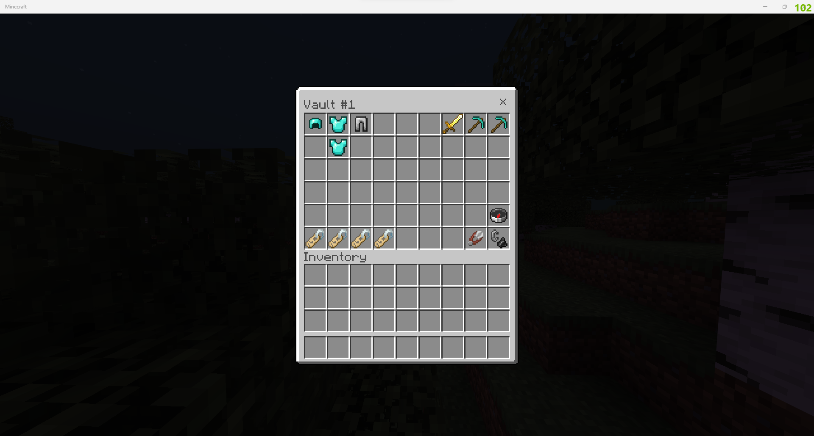

# PlayerVaults
[](https://poggit.pmmp.io/p/PlayerVaults)
[](https://poggit.pmmp.io/p/PlayerVaults)


A PocketMine-MP plugin that gives players a secondary portable inventor(y/ies) of 54 slots in size. These inventories can be accessed anywhere!

## Usage
Run `/pv 1` to access your personal Vault #1.


## Wiki
Refer to the [PlayerVaults Wiki](https://github.com/Muqsit/PlayerVaults/wiki) to get help with commands and permissions.

## Example API Usage
Opening player's vault #1 as a `$player`.

```php
use muqsit\playervaults\PlayerVaults;
use muqsit\playervaults\PlayerVaultsException;use muqsit\playervaults\vault\Vault;use pocketmine\player\Player;
use pocketmine\Server;

/** @var Player $player */
/** @var PlayerVaults $plugin */
$plugin = Server::getInstance()->getPluginManager()->getPlugin("PlayerVaults");

// without debug messages:
$plugin->openVaultWithPermission($player, $player->getName(), 1);

// with debug messages:
$plugin->openVaultWithPermission($player, $player->getName(), 1, function(Vault $vault) use($player) : void{
    $player->sendMessage("Successfully opened vault");
}, function(PlayerVaultsException $exception) use($plugin) : void{
    $plugin->getLogger()->debug("Failed to open vault: {$exception->getMessage()} (code: {$exception->getCode()})");
});
```

Opening another player (`Alex`)'s vault #1 as a `$player`.
```php
use muqsit\playervaults\PlayerVaults;
use pocketmine\player\Player;
use pocketmine\Server;

/** @var Player $player */
/** @var PlayerVaults $plugin */
$plugin = Server::getInstance()->getPluginManager()->getPlugin("PlayerVaults");
$plugin->openVaultWithPermission($player, "Alex", 1);
```

Forcefully (skipping permission checks) opening another player (`Alex`)'s vault #1 as a `$player`.
```php
use muqsit\playervaults\PlayerVaults;
use pocketmine\player\Player;
use pocketmine\Server;

/** @var Player $player */
/** @var PlayerVaults $plugin */
$plugin = Server::getInstance()->getPluginManager()->getPlugin("PlayerVaults");
$plugin->openVault($player, "Alex", 1);
```

Reading and writing to a specific vault (player `Alex`'s vault #1).
```php
use muqsit\playervaults\PlayerVaults;
use muqsit\playervaults\vault\Vault;
use muqsit\playervaults\vault\VaultAccess;
use pocketmine\item\VanillaItems;
use pocketmine\Server;

/** @var PlayerVaults $plugin */
$plugin = Server::getInstance()->getPluginManager()->getPlugin("PlayerVaults");
$plugin->loadVault("Alex", 1, function(Vault $vault, VaultAccess $access) : void{
    $inventory = $vault->getInventory();
    $item = $inventory->getItem(0); // item in first slot
    $inventory->addItem(VanillaItems::APPLE());
    $access->release(); // unloads vault and if necessary, saves vault
});
```

Writing to a specific vault asynchronously.
```php
use muqsit\playervaults\PlayerVaults;
use muqsit\playervaults\vault\Vault;
use muqsit\playervaults\vault\VaultAccess;
use pocketmine\item\VanillaItems;
use pocketmine\scheduler\ClosureTask;

/** @var PlayerVaults $plugin */
$scheduler = $plugin->getScheduler();
$plugin->loadVault("Alex", 1, function(Vault $vault, VaultAccess $access) use($scheduler) : void{
    $inventory = $vault->getInventory();
    $scheduler->scheduleRepeatingTask(new ClosureTask(function() use($inventory, $access) : void{
        $inventory->addItem(VanillaItems::APPLE());
        $access->release();
    }), 100);
});
```
